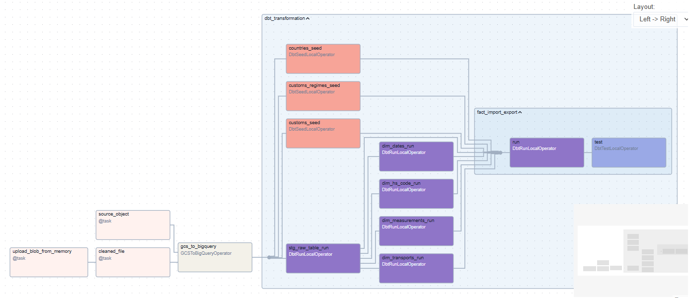

# ELT Pipeline: Paraguay Import/Export Data

This project demonstrates a fully automated **ELT (Extract, Load, Transform)** pipeline that collects, processes, and visualizes Paraguay’s public trade data. It uses **Apache Airflow (Astro CLI)** for orchestration, **Cosmos** to run dbt transformations within Airflow, **Google Cloud Platform (GCS & BigQuery)** for cloud storage and processing, and **Power BI** for dashboards.

---

## 📌 Project Description

This pipeline automates the entire lifecycle of data collection and analysis for Paraguay’s import and export data, published monthly by the country’s customs authority.

### ✅ What It Does — In Simple Terms:
- Once a month, the system **automatically downloads** a CSV file from a government website.
- The file is saved to **Google Cloud Storage** for backup and further processing.
- A **pre-cleaned version** of the file is loaded into **BigQuery**.
- Using **dbt**, the data is cleaned, transformed, and structured into usable models.
- **Power BI dashboards** use these models to provide **insights and visualizations** — all without manual work.

This entire process is **automated** and **repeatable**, built using modern data tools to ensure accuracy, scalability, and maintainability.

---

## 🧾 Step-by-Step Pipeline Overview

1. **🔽 Monthly Data Extraction**  
   The pipeline downloads the latest CSV file from a Paraguayan government website containing official trade data.

2. **☁️ Cloud Storage in GCS**  
   The raw CSV is uploaded to a **Google Cloud Storage bucket**, creating a reliable, versioned archive.

3. **🧽 Data Cleaning**  
   Basic processing ensures column names, encodings, and formats are valid for ingestion.

4. **📥 Load into BigQuery**  
   Cleaned data is loaded into a **raw BigQuery table**, providing a base layer for transformations.

5. **🛠️ Transformations with dbt**  
   dbt (via Cosmos inside Airflow) performs:
   - Standardized cleaning of raw data
   - Creation of dimension and fact tables
   - Structured, maintainable SQL models that reflect business logic

6. **📊 Power BI Dashboards**  
   Final dbt models feed directly into Power BI reports and dashboards to support exploration and insight generation.

Here’s how the data flows into reporting:

  

---

## ⚙️ Technical Stack

| Tool | Purpose |
|------|---------|
| **Astro CLI** | Local orchestration environment with Docker |
| **Apache Airflow** | DAG scheduling and pipeline automation |
| **Cosmos** | Seamless integration of dbt models into Airflow |
| **Google Cloud Storage** | Stores raw CSV data |
| **BigQuery** | Cloud data warehouse for processing |
| **dbt Core** | SQL-based transformations, model building |
| **Power BI** | Business intelligence and visualization |

---

## 🎯 Project Goals

- Automate ingestion, cleaning, and transformation of public data
- Ensure reproducibility, scalability, and cloud-native deployment
- Provide clear, dynamic insights to stakeholders via dashboards
- Demonstrate modern data engineering best practices

---

## 🔐 Security Note

- GCP service account credentials and dbt `profiles.yml` are **excluded** from the repository for security reasons.
- You must configure these locally using the included `.gitignore` and reference templates.

